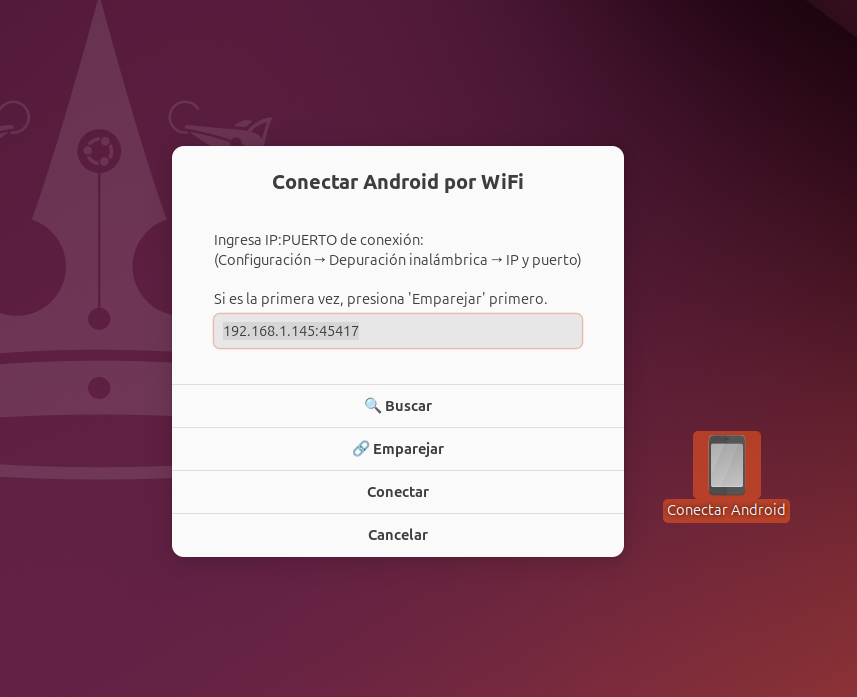

# Android Wireless Debugging

Herramienta gráfica para conectar dispositivos Android por WiFi usando ADB (Android Debug Bridge).

Permite depurar aplicaciones Android sin cables USB, con una interfaz simple e intuitiva.


## Vista Previa



*Interfaz principal con acceso directo en el escritorio. Un doble clic y conecta tu Android por WiFi.*

## Características

- **Acceso directo en el escritorio**: Un doble clic y listo, sin abrir terminal ni buscar en menús
- **Conexión automática vía USB**: Conecta tu dispositivo por USB y automáticamente habilita WiFi debugging
- **Conexión directa por IP**: Ingresa manualmente la IP y puerto del dispositivo
- **Emparejamiento de dispositivos**: Soporte completo para el nuevo sistema de emparejamiento de Android 11+, con código o QR
- **Búsqueda automática**: Escanea la red local para encontrar dispositivos Android
- **Interfaz gráfica**: Usa Zenity para diálogos amigables (también funciona en terminal)
- **Guarda configuración**: Recuerda la última conexión exitosa
- **Instalación sencilla**: Un solo comando instala todo automáticamente

## Requisitos

- Linux (Ubuntu, Debian, Fedora, Arch, etc.)
- ADB (Android Debug Bridge)
- Zenity (opcional, para interfaz gráfica)
- qrencode (para generar el QR de emparejamiento)
- libnotify (opcional, para notificaciones)

## Instalación

### Opción 1: Instalación rápida (recomendada)

```bash
git clone https://github.com/webmasterscity/androidWirelessDebugging.git
cd androidWirelessDebugging
./install.sh
```

El instalador automáticamente:
- Instala las dependencias necesarias (ADB, Zenity, qrencode)
- Crea un **acceso directo en tu escritorio** para acceso rápido
- Agrega la aplicación al menú de aplicaciones
- Detecta tu distribución Linux (Ubuntu, Fedora, Arch, etc.)

### Opción 2: Instalación manual

```bash
# Instalar dependencias
sudo apt install adb zenity libnotify-bin qrencode

# Clonar repositorio
git clone https://github.com/webmasterscity/androidWirelessDebugging.git
cd androidWirelessDebugging

# Copiar script
mkdir -p ~/.local/bin
cp conectar-android.sh ~/.local/bin/
chmod +x ~/.local/bin/conectar-android.sh

# Instalar acceso directo (opcional)
cp conectar-android.desktop ~/.local/share/applications/
```

## Uso

### Desde el escritorio (recomendado)

Después de instalar, encontrarás el icono **"Conectar Android"** directamente en tu escritorio. Solo haz **doble clic** para conectar tu dispositivo Android por WiFi.

> Esta es la forma más rápida y conveniente de usar la aplicación. No necesitas abrir terminal ni buscar en menús.

### Desde el menú de aplicaciones

Busca "Conectar Android" en el menú de aplicaciones de tu escritorio.

### Desde terminal

```bash
conectar-android.sh
```

### Conexión vía USB (más fácil)

1. Conecta tu Android por USB
2. Ejecuta la aplicación
3. Automáticamente habilitará WiFi debugging
4. Desconecta el USB y sigue trabajando por WiFi

### Conexión directa por WiFi (Android 11+)

1. En tu Android ve a **Configuración > Opciones de desarrollador > Depuración inalámbrica**
2. Activa "Depuración inalámbrica"
3. Si es la primera vez, presiona "Emparejar" en la app y elige el método:
   - **Por código**: toca "Emparejar dispositivo con código" en tu Android, ingresa la IP:Puerto de emparejamiento y el código de 6 dígitos
   - **Por QR**: toca "Emparejar dispositivo con QR code" en tu Android y escanea el QR que muestra la app
4. Usa la IP:Puerto de conexión (diferente al de emparejamiento) para conectar

## Configuración en Android

### Habilitar Opciones de Desarrollador

1. Ve a **Configuración > Acerca del teléfono**
2. Toca 7 veces en "Número de compilación"
3. Regresa y verás "Opciones de desarrollador"

### Habilitar Depuración USB/WiFi

1. Ve a **Configuración > Opciones de desarrollador**
2. Activa "Depuración USB"
3. Para WiFi (Android 11+): Activa "Depuración inalámbrica"

## Solución de problemas

### "ADB no encontrado"

```bash
# Ubuntu/Debian
sudo apt install adb

# Fedora
sudo dnf install android-tools

# Arch
sudo pacman -S android-tools
```

### "No se puede conectar"

- Verifica que ambos dispositivos estén en la misma red WiFi
- Asegúrate de haber emparejado el dispositivo primero (Android 11+)
- El puerto cambia cada vez que activas la depuración inalámbrica

### "Dispositivo no autorizado"

- Revisa tu teléfono, debería aparecer un diálogo pidiendo autorización
- Marca "Permitir siempre desde esta computadora"

## Desinstalación

```bash
./install.sh --uninstall
```

O manualmente:

```bash
rm ~/.local/bin/conectar-android.sh
rm ~/.local/share/applications/conectar-android.desktop
rm ~/Escritorio/conectar-android.desktop  # o ~/Desktop en inglés
rm ~/.config/conectar-android.conf
```

## Contribuir

Las contribuciones son bienvenidas. Por favor:

1. Haz fork del repositorio
2. Crea una rama para tu feature (`git checkout -b feature/nueva-funcionalidad`)
3. Haz commit de tus cambios (`git commit -m 'Agrega nueva funcionalidad'`)
4. Push a la rama (`git push origin feature/nueva-funcionalidad`)
5. Abre un Pull Request

## Licencia

Este proyecto está bajo la Licencia MIT. Ver el archivo [LICENSE](LICENSE) para más detalles.

## Autor

- **Leonardo** - [webmasterscity](https://github.com/webmasterscity)

---

Si te resulta útil, considera darle una estrella al repositorio.
